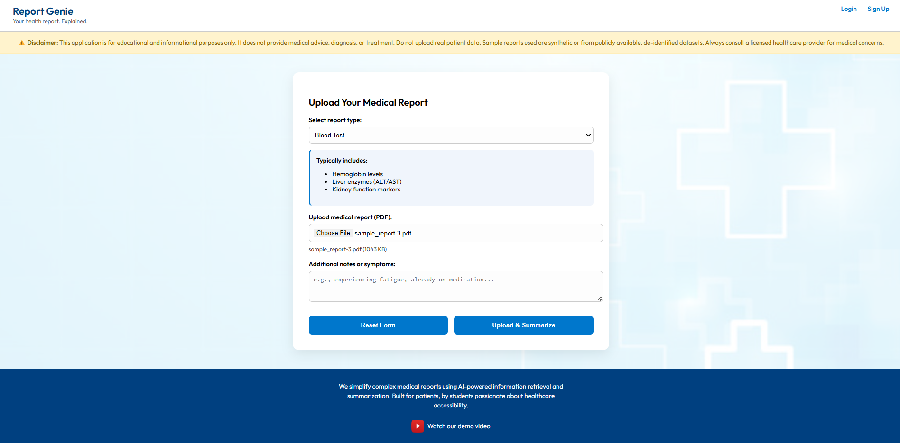
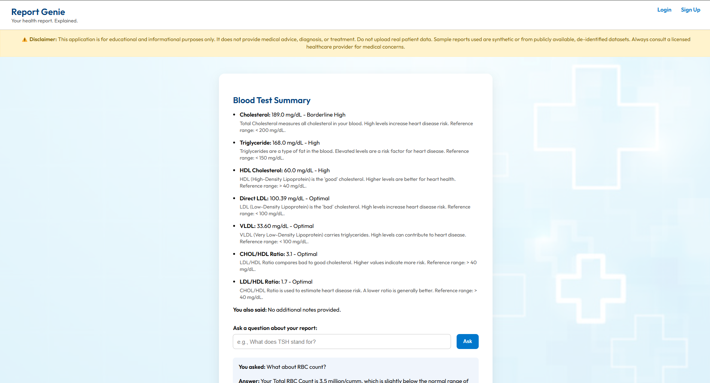

# 🩺 Report Genie — AI-Powered Medical Report Summarizer

Report Genie is a Flask-based web application that allows users to upload medical reports (PDF), automatically extract test values (e.g., Hemoglobin, Cholesterol), and generate patient-friendly descriptions using Retrieval-Augmented Generation (RAG) powered by Gemini and PubMed.




---

## 🚀 Features

- 🧾 Upload blood test PDF reports
- 🤖 Automatically extract test names and values using Gemini
- 🔍 Use BM25 + FAISS or PubMed abstracts to retrieve relevant context
- 🧠 Generate friendly explanations for each test using Gemini
- 📝 Supports user notes and optional Q&A about their report

---

## 🛠 Tech Stack

- `Python 3.10+`
- `Flask` — for backend server
- `PyMuPDF (fitz)` — for extracting text from PDFs
- `Gemini Pro / Gemini Flash` — for language generation
- `FAISS` + `BM25` — for hybrid retrieval
- `PubMed API (Entrez/Biopython)` — for real medical context
- `Bootstrap` — for frontend styling

---

## 📦 Setup Instructions

### 1. Clone the repository
   ```bash
   git clone https://github.com/yourusername/report-genie
   cd report-genie
   ```

### 2. Install dependencies
   ```bash
   pip install -r requirements.txt
   ```

### 3. Add your Gemini API key
Create a file called .env in the project root:
   ```bash
   GOOGLE_API_KEY=your_gemini_api_key_here
   MODEL_PATH=your_model_path_here
   ```

### 4. Run the app
   ```bash
   python app.py
   ```

### 5. Open in browser
   ```bash
   http://localhost:5000
   ```
